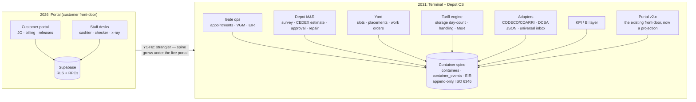
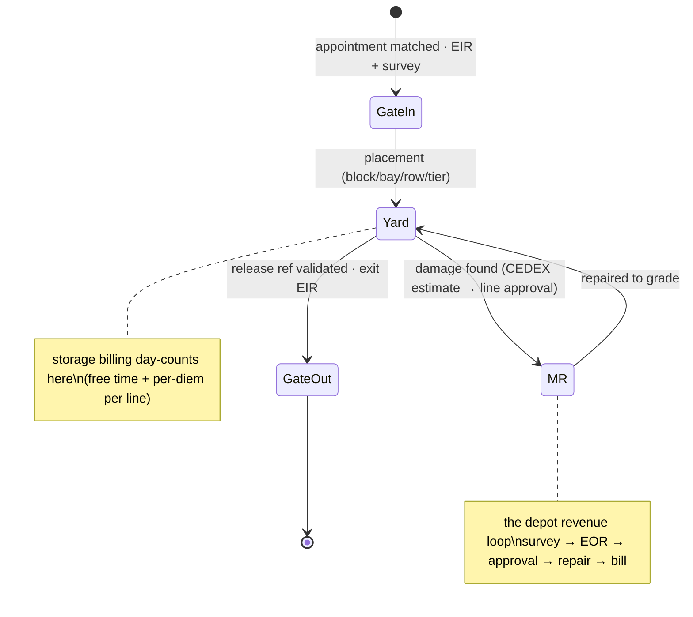
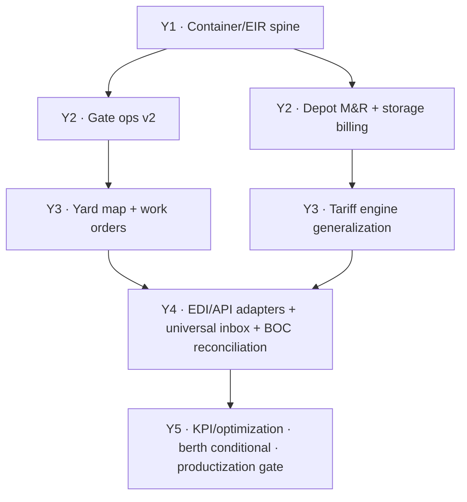

# KTC Five-Year Roadmap — from Online Portal to Terminal + Depot Operating System

**Written 2026-07-02** · Owner-commissioned ("ktc-portal will become a Navis-system: a TOS-ERP port terminal and depot management system") · Executes the direction **already ratified in ADR-0015** (Octopi-class modular system, container/EIR spine first — Accepted 2026-06-13) on a five-year horizon with methodology, technicalities, and agent assignment.

**Evidence base:** ADR-0015 + `docs/research/navis-tos-landscape-2026-06-13.md` (fact-checked 13/14 claims) + a 5-agent landscape refresh run 2026-07-02 (TOS market · TOS data models · PH regulatory · depot-systems vendor scan · in-repo grounding; findings cited inline). This is a **living plan**: re-judged at each year's exit gate and at every framework annual re-plan; the sequence is binding, calendar years are not (same rule as the sibling repo's plan).

---

## 0. Executive summary

KTC's portal today is the **customer front-door + special-services billing layer** of a TOS — the piece incumbents sell separately (the "Forecast-portal" analog) — with pieces of gate, billing, and inspection workflows already live. What it is not yet: a system where **the container itself is the first-class object**. ADR-0015 already decided the fix: build the **container data spine** (ISO 6346-keyed `containers` + append-only `container_events` + EIR documents at gate events), then grow modules as projections over that spine.

The five-year shape: **Y1** finish go-live + operate + build the spine · **Y2** gate operations + depot M&R (the revenue core of depot software) · **Y3** yard positions + generalized tariff billing · **Y4** integration (EDI/API dual-speak with lines, BOC reconciliation) · **Y5** KPIs/optimization + the owner-gated productization option. Reference class stays **Octopi/depot-tier, never N4** — the research re-confirmed that small terminals pay for enterprise TOS and use ~30% of it, while the depot tier's web-native segment is where a modern challenger wins (legacy incumbents are consolidating via acquisition, not modernizing UX).

Every module ships through the framework's Loop (spec → plan → build → verify → ship) with `jarvis` on all money/permission paths, and every module *class* goes live through the 15-station production line. Agent assignment per phase is §7.

---

## 1. Where we stand (mid-2026)

| Layer | State | Evidence |
|---|---|---|
| Customer portal (JO, billing, releases, checker/x-ray, vessel schedule, CIS) | **Live-adjacent, v2.0.x** — break-test closed (all 7 findings), blind walkthrough done 2026-07-01; go-live line at the last stations | `docs/audits/2026-07-02-prelaunch-battery.md` (184/184 read-only; pending per `docs/go-live-todo.md` §5: mutating e2e · fresh roast · go/no-go doc · watch-window, plus the ST08 run in §4) |
| Money spine (charges → payment orders → audit) | Sound — 8 billing invariants, double-collection guarded (0239) | prelaunch battery; `docs/agent/domain-scm-knowledge.md` |
| Container-as-object (B1 spine) | **Absent** — "the single biggest missing foundation" | June research §E; ADR-0015 |
| Vessel/berth (B2), yard positions (B3), EDI | Absent (deferred by design — scope + the early-EDI fence) | ADR-0015 + June research §E |
| Gate (B4), billing/VAS incl. inspections (B7) | Partial — implemented as portal workflows, not spine projections | June research §E |
| Depot M&R | Absent | June research §C |

**Standing decisions that constrain this plan (do not re-litigate without new evidence):** Octopi-class not N4 (ADR-0015 option A rejected) · spine first (option C rejected) · buy-vs-build revisit only after the "existing TOS" characterization (option D "not foreclosed") · do-NOT-attempt-early list (stowage optimization, full EDI suite up front, equipment automation, optimizer decking, BIR invoice rebuild, PCS membership) · BIR invoicing stays in the existing accounting stack.

**Open questions carried from ADR-0015 (owner's to answer, each gates a fork below):** (1) characterize KTC's *existing* operational tooling — decides upgrade-vs-create per module; (2) which pillar leads commercially, terminal ops vs depot M&R vs billing; (3) container-only or mixed-cargo spine (affects the data model — decide before Y1-H2 schema freeze).

---

## 2. Year 1 (2026–27) — Operate, then lay the spine

**Objective:** the portal is LIVE and boring (in the good sense), and by year-end every container that crosses the gate exists as a first-class record with an event history and an EIR.

**H1 — finish and operate (no new modules until this is done):**
1. Close the four open go-live stations (mutating e2e → fresh roast at the 90-bar → ST08 side-by-side → go/no-go doc with rehearsed rollback) + define the watch-window artifact. Owner items ride `docs/go-live-todo.md` (NPC, counsel, staff 2FA).
2. Operate under the watch window; field defects re-enter the line at Station 0 (andon rule). Scorecard rows per ship; first `jarvis` recall calibration (seeded bugs) before any new-module work.
3. Stand up the repo eval mini-set (3–5 golden cases: charge math, `consignees_public` RLS matrix, double-collection regression) — prerequisite: the framework runner's cwd-fallback (global playbook Y4.2).

**H2 — the container/EIR spine (ADR-0015's keystone):**
- **Schema (from the refreshed minimal models):** `containers` (ISO 6346 number with check-digit validation + 4-char size/type + owner line + grade + reefer/hazmat flags — designed in from day one) · append-only `container_events` (event_type, ts, location, actor, source_doc_ref) as **the source of truth**; any `current_state` is a derived cache, never authored · `eir` records generated at every gate event (photos, CEDEX-coded damage marks, seal, weight, signatures) — reusing the checker e-sig + upload/review patterns the portal already has (ADR-0015's stated sequencing rationale).
- **Wiring:** existing JO/release/checker flows begin *referencing* spine records (foreign keys in, no behavior change) — the strangler pattern: the portal keeps working while the spine grows under it.
- **Invariants (eval cases from birth):** check-digit rejects invalid numbers; events are append-only (no UPDATE/DELETE path exists); every gate transaction has exactly one EIR; RLS scopes spine reads per principal.

**Exit gate:** 100% of gate crossings spine-recorded for 60 consecutive days; EIR generation ≤2 min at gate; zero spine-integrity eval failures. **KPIs born this year:** gate transactions/day, EIR completeness %, portal uptime.

---

## 3. Year 2 (2027–28) — Gate operations + depot M&R (the depot revenue core)

**Objective:** the gate is a system, not a guard with paper — and the survey → estimate → approval → repair → release cycle (the defining workflow of depot software, absent from pure terminal TOS) is billable end-to-end.

**Modules & technicalities:**
- **Gate ops v2:** `gate_appointment` (windowed slots — reuse the yield/overbooking model already mapped in `docs/agent/domain-scm-knowledge.md`) · `gate_transaction` (direction, lane, seal, condition codes, weight, driver/chassis, EIR ref) · trucker registry carrying **PPA TAPP accreditation** (3-yr validity, 60-day pre-expiry renewal alarms — the renewal-tracking overhead scales linearly with fleet, so it's systematized now) · weighbridge/VGM capture with **NLMP calibration-certificate expiry alarms** (an uncertified weighbridge blocks export loading outright — a hard gate, so its certification state is a monitored system fact, not a binder in a drawer).
- **Depot M&R:** survey records (on-hire / off-hire / routine gate, against the gate photos) · `damage_line` on **CEDEX (ISO 9897)** component/damage/repair codes · `mr_estimate` (itemized: component + damage + labor norm-hours + material, priced off the per-line tariff card — IICL-6 as the default standard) · line-approval workflow (approve / reject-line-item / request-photos; auto-approval rules by damage-code/cost-threshold so staff work exceptions — the modern-vendor pattern) · repair execution bounded to approved scope · release only after grade restored. Internally these model the **DESTIM → WORDER** message semantics — as state transitions first, wire formats in Y4 (the June research's sequencing, consistent with ADR-0015's early-EDI fence).
- **Storage billing:** day-counted from gate-in to gate-out per principal contract (free-time + per-diem), invoiced from the movement record — never hand-computed. Gate/handling and M&R markup bill off the same movement spine.

**Methodology:** M&R touches money + a principal-facing approval contract → every estimate/billing RPC is red-zone: `/spec` with pre/postconditions, property tests derived from the tariff card, `jarvis` mandatory. Gate+M&R together = a module-class go-live → full 15-station line run (its second time; the first was Y1 H1).

**Exit gate:** one full M&R cycle (survey→invoice) for ≥2 shipping lines in production; storage invoices auto-derived and reconciled for a full quarter; gate throughput measured (target: transaction ≤5 min pre-OCR). **KPIs:** M&R estimate turnaround, approval rate, storage-revenue capture vs manual baseline, gate dwell.

---

## 4. Year 3 (2028–29) — Yard truth + billing generalization

**Objective:** the system knows where every box physically is, and every peso of yard revenue derives from movement records.

**Modules & technicalities:**
- **Yard map:** `yard_slot` (block/bay/row/tier, unique-constrained; reefer-plug + hazmat flags per slot) · `container_placement` (open row = current position; **occupancy is a query, never a stored flag** — the drift-proof pattern from the research's minimal models) · graphical yard view in the portal (the depot-tier table-stakes feature) · rehandle counting (ideal = the box is touched twice; every extra touch is measured waste — the kaizen metric for yard discipline).
- **Move/work orders:** `work_order` rows per physical move (move_type, from/to slot, priority, status) with a **pull-based single-next-job queue** per equipment unit (not shift manifests) and exception states in the queue UI.
- **Tariff engine generalization:** the portal's charge logic refactored into a per-principal tariff engine (handling / storage / reefer plug-days / VAS / M&R) — every invoice line traceable to (movement event × tariff row). This is the refactor that makes Y4's automated line-billing possible.
- **Reefer tier-1:** `reefer_unit` setpoints + manual-round readings with threshold alerts (the small-terminal fallback tier); telemetry hardware deferred until unit-count justifies it (FP2 — no speculative IoT).

**Exit gate:** yard position accuracy ≥98% on cycle counts; rehandles/move trending down two consecutive quarters; 100% of yard invoices derived from events. **KPIs:** rehandles/move, yard utilization by block, position-accuracy, revenue per TEU-day.

---

## 5. Year 4 (2029–30) — Integration: speak the lines' languages

**Objective:** the depot stops re-keying what counterparties already sent, and the lines stop phoning for what they can pull.

**Modules & technicalities (the adapter pattern — EDI deferred by ADR-0015, shaped by the June research §F, confirmed by the refresh):**
- **Outbound:** `outbound_message` adapter table decoupling the internal event log from wire formats — the same gate-out event renders as **EDIFACT CODECO** for one line and **DCSA T&T JSON** for another (the industry is mid-transition through the late 2020s; a small depot must dual-speak, and the adapter table is what makes that cheap).
- **Inbound — the universal inbox (the research's sharpest lesson):** accept whatever the counterparty actually sends — EDI, spreadsheet, PDF pre-advise, portal email (the PH reality: manual email pre-advise with per-request container caps is *standard practice* at major lines here) — and normalize into COPARN/COREOR-semantic release/booking instructions internally. **Never gate integration on the counterparty's modernization.**
- **Release validation:** gate-out authorizes only against a matched line release/booking reference (the depot's legal protection), condition re-verified at exit.
- **BOC reconciliation surfaces:** e2m/e-Manifest is live at the Port of Davao — KTC **reconciles**, never files: match spine events against E-TRACC electronic-seal events for transfers (per-movement, not one-time, incl. the barge/sea extension), X-ray queue records against BOC inspection regimes. PEZA-adjacent flows (if ecozone clients materialize) get their own e-transfer track — scoped only when a client exists.
- **Identity:** register a BIC Facility Code when the first line's system asks for one.
- **Onboarding sequence:** start with the ONE line with the highest box volume at the depot; prove CODECO round-trip; then the second. Per-carrier idiosyncrasy is the cost center — budget it (the research: EDI is the domain's single biggest hidden cost; Octopi sells managed EDI as a service for exactly this reason).

**Exit gate:** ≥1 line live on automated gate-move reporting for a quarter with zero missed-movement disputes; universal inbox handling ≥80% of inbound instructions without re-keying. **KPIs:** % movements auto-reported, re-key rate, dispute count, days-sales-outstanding on line invoices (the CCC lens from the domain map).

---

## 6. Year 5 (2030–31) — Measure, optimize, and the productization option

**Objective:** the system optimizes what it already records — and the owner decides, from a position of strength, whether it becomes a product.

- **KPI/BI layer:** moves/hour (per equipment class), truck turn time, dwell distribution, rehandles/move, M&R cycle time, storage-revenue capture, gate exceptions — ambient dashboards (the visual-factory tier), not report requests.
- **Berth/vessel scheduling (conditional):** IF vessel-side business grows: the single-table interval scheduler (`vessel_call` with ETA/ETD windows against 1–2 berths; conflicts = overlapping confirmed windows) — deliberately below the optimization-engine tier the do-not-attempt list fences.
- **Equipment/labor maturity:** work-queue analytics → shift-level balancing (the takt lens: pace gate appointments to yard/equipment absorption — the same Little's-Law rule the delivery process itself runs on).
- **The productization decision (OWNER GATE — an ADR, not a drift):** the market research holds a genuine gap — web-native, agentic-era depot systems against legacy incumbents being acquired rather than modernized; the small-tier reference price point exists (~$750/mo class); Mindanao's own landscape (the region's flagship terminal runs its own depot; a fragmented private-operator field around it) is addressable. IF five years of operating KTC's own depot on this system proves the workflows, THEN multi-tenancy + the go-public checklist + the framework's productization list activate. **"No — it stays KTC's edge" is an equally valid outcome.** Decision inputs the plan will have banked: per-module cost records, uptime history, the KPI baselines, and a working system as the demo.

**Exit gate (the plan's own):** the annual re-plan judges Y5 against the market as it stands in 2030 — this document expects to be rewritten by then; what must survive is the spine and the event log (they are format-independent by construction).

---

## 7. Agent assignment & execution methodology (who builds what, per phase)

The delivery method is owned by the global framework layer (the Loop · the 15-station go-live line · `jarvis` · the eval harness); this table routes THIS plan's work through it. Class names follow the framework's builders-notes routing.

| Work class | Examples in this plan | Agent routing | Verification |
|---|---|---|---|
| Discovery / characterization | "existing TOS" characterization (open Q1), per-line EDI idiosyncrasy scans | Explore-class scouts, read-only, summary back | owner reads the brief |
| Schema + RPC spine design | containers/events/EIR (Y1), tariff engine (Y3), adapter tables (Y4) | default-class with `/spec` (immutable acceptance criteria + invariants-as-properties); single-owner traversal — one agent carries a module end-to-end | `jarvis` mandatory (money/permission class) + eval cases born with the schema |
| CRUD surfaces / screens | gate forms, yard views, M&R estimate UI | Sonnet-class off the confirmed spec; every stage reads the ORIGINAL spec (anti-bullwhip rule) | roast pass at 90-bar per release wave |
| Money / billing logic | storage day-count, M&R pricing off tariff cards, line invoicing | default-class; **never Sonnet-solo** | `jarvis` + derived-expected-values (never trust the test), property tests from the tariff card |
| Integration adapters | CODECO/DCSA renderers, universal-inbox normalizers | default-class (parsing rigor); red-tested against planted malformed messages before any live feed | fixture round-trips + a planted-positive rule: an adapter that never matched a bad message is not a guard |
| Module-class go-lives | Y1 portal, Y2 gate+M&R, Y4 first line integration | the full 15-station production line, blind lane included | owner side-by-side, every path agrees |
| Continuous | scorecard per ship · quarterly `jarvis` recall · eval mini-set grows per module · annual re-plan | — | the framework's standing rhythm |

**Standing rules for every year:** the spine's event log is append-only forever (the audit trail IS the product in a custodian business — every box belongs to a principal and every move is billed back to it) · BIR invoicing stays out (ADR-0015) · no module starts while its predecessor's exit gate is red (dependency, not visibility) · improvement investment follows FP13 (quality → reliability → speed → cost).

---

## 8. Architecture: now → target

---

## 9. Risks & kill-checkpoints (reviewed at every year's exit gate)

| Risk | Signal | Response |
|---|---|---|
| Regulatory shift (TOP-CRMS unfreezes; PPA/BOC turf resolves against off-dock operators) | any new PPA/BOC issuance touching depot registration | re-scope Y4's compliance surfaces first — regulation outranks roadmap |
| Talent wall (regional TOS-ops talent is "dozens, not hundreds") | hiring/ops onboarding stalls a module's adoption | slow the module cadence, deepen operator UX + training material instead — adoption beats features |
| Line-integration cost blowout (the domain's known hidden cost) | first CODECO onboarding exceeds 2× its spec estimate | stop; universal-inbox-only for that line; re-estimate the Y4 exit gate |
| Spine schema wrong for mixed cargo (open Q3 unanswered before Y1-H2) | breakbulk/RoRo business materializes | the schema freeze WAITS on Q3's answer — this is a named blocker, not a surprise |
| Buy-option resurfaces (ADR-0015 Q1) | "existing TOS" characterization finds a system worth keeping | honest buy-vs-build ADR before Y2 commits — option D was never foreclosed |
| Solo-operator bus factor | — | the successor-notes + this plan + the framework's methodology ARE the mitigation: any capable agent continues from the written state |

**Never on this roadmap (the fence, restated):** N4-scale automation, stowage optimization, optimizer decking, PCS membership, BIR invoice rebuild — revisiting any of these requires new evidence and an ADR, not enthusiasm.

---

*Methodology pointer: the global engineering bible (13 First Principles), the go-live production line, and `docs/agent/successor-notes.md` govern HOW every item above is executed. Domain grounding: `docs/agent/domain-scm-knowledge.md`. Provenance of external claims: `docs/research/2026-07-02-tos-depot-landscape-refresh.md` (this refresh, archived in-repo with per-fact source URLs) and `docs/research/navis-tos-landscape-2026-06-13.md`; regulatory citations inline above are as-of 2026 and must be re-verified at use (the freshness rule applies to laws too).*
